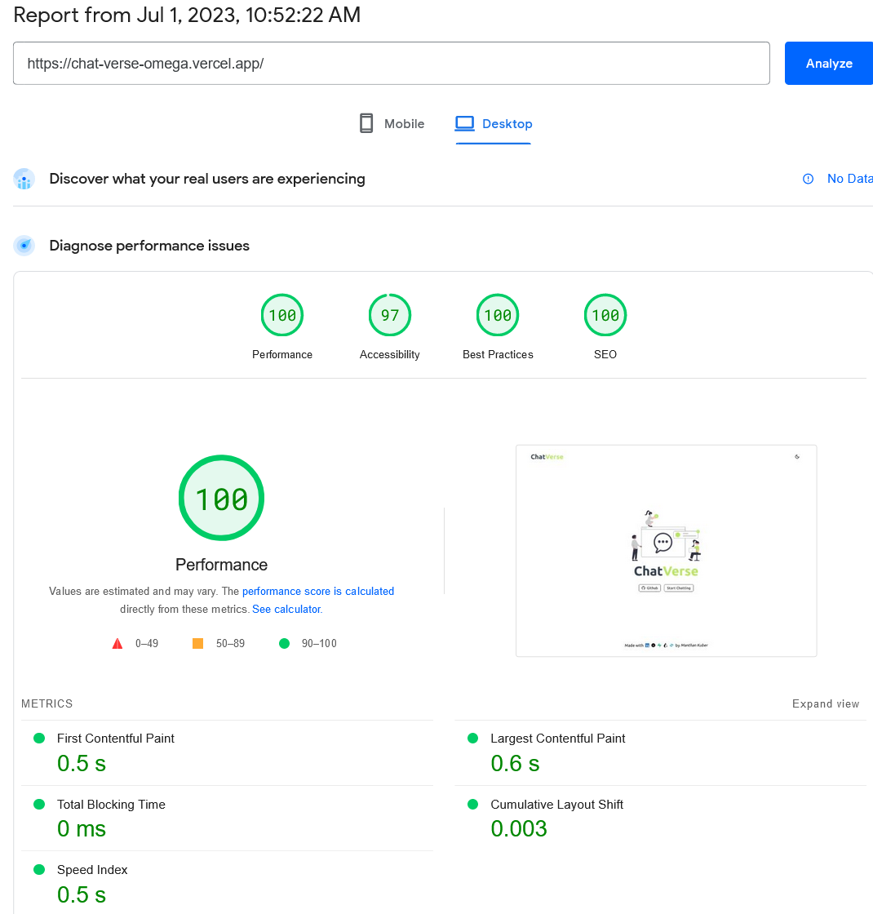

# ChatVerse

[ChatVerse](https://chat-verse-omega.vercel.app/) is a real-time, one on one chat app powered by web sockets 
Entirely made by yours truly from UI/UX and writing database schemas to deployment with minute attention to detail 
Built with my absolute favourite programming language - TypeScript 
Here's the repo of the [Websocket server](https://github.com/Manthan-Kuber/ChatVerseSocketServer) written in NodeJs,ExpressJs and TypeScript   
Don't forget to ⭐ the repo

## Tech Stack

- Built with `create-t3-app` i.e the T3 stack minus tRPC.
- Built Entirely in **TypeScript**
- Uses **NextJS** for FullStack development framework
- Uses **TailwindCSS** as a CSS framework
- Uses [Framer Motion](https://www.framer.com/motion/) for animations
- Uses **Supabase** as BaaS which uses **PostgreSQL** under the hood
- Uses **Prisma** as ORM
- Uses [Zod](https://zod.dev/) from schema validation
- Uses a **hybrid backend architecture** consisting of:
  1. NextJS's **serverless functions** to perform database queries
  2. **NodeJs + ExpressJs** server to facilitate realtime websocket based **full duplex** communication
- Uses [Socket.IO](https://socket.io/) for managaing websocket communication
- Uses [NextAuth](https://next-auth.js.org/) for managing authentication
- Uses a SMTP server for password-less e-mail based authentication
- Uses vercel's [SWR](https://swr.vercel.app/)(stale-while-revalidate) react hooks for data fetching,caching and (re)validation
- Uses [react-window](https://github.com/bvaughn/react-window) for efficiently rendering large lists

## Page quality insights

## Features

- Realtime websocket based chatting 💬
- Modern, minimal and clean UI with animations
- Dark mode 🌑 and light mode ☀️
- Fully responsive layout
- Loading skeletons,toasts and modals for a good UX
- React Hook Form based backend form validation
- Zod validated and protected NextJs API routes
- Session based, protected API routes
- Optimistic UI updates
- An Auth HOC built with Next-Auth to authenticate each request
- OAuth2 integration
- Passwordless authentication
- Send authentication mails through a SMTP server
- Data caching and validation
- WhatsApp like text box
- Online user status
- Clean,consistent and performance oriented codebase written in TS
- Uses best practices avoiding any anti-patterns
- SEO friendly
- Clean and modular react TS components
- Well documented codebase with comments written to explain the logic behind anything written
- Semantic commits

## Approaches Used / Decisions / Thought Process 

### NextJs and Realtime Communication

NextJs's serverless functions are incapable of maintaining persistent http connections which are required for any real time full duplex client-server communication Creating a websocket server using NextJs's API routes hence is not possible and proves to be problematic in production environment. My initial implementation of the socket server was based on Next API routes as it does work in development environment. So I had several options to choose from for implementing realtime communication in NextJs.Some of these were as follows:

1. The first one was to use subscribe to the changes done in the database table, fetch the new message as soon as a change is detected in the table, and append it to the collection of messages stored in the client state. "Supabase", which I am using for this project provides certain APIs to subscribe to the changes done in a specific table.  "Pusher" suggested by the NextJs team as an approach to realtime communication provides similar services using bi-directional hosted APIs.
2. Using a chat engine.
3. Implementing websockets from scratch using the browser WebSocket API. This approach requires a manual websocket handshake which is a tedious approach and may not use best practices and switch protocols as and when needed.
4. Use Socket.IO - a library that enables low-latency, bidirectional and event-based communication between a client and a server.

I chose to go with Socket.IO as it is most commonly used approach,is well documented and as far as troubleshooting is concerned, lot of resources from StackOverflow and GitHub discussions are available.It uses certain APIs to emit events to and from the socket server.Moreover, it is also capable of falling back to another protocol like HTTP long-polling or making a auto reconnection in case a websocket handshake fails. A socket server acts as a middle man that collects incoming messages from clients connected to the server and forwards them to the respective SocketIds. 
Approach 3. and 4. both require a separate server app. I went with creating a websocket server with the classic NodeJs + expressJs config along with TypeScript.

### PostgreSQL over MongoDB

All real world applications generally consist of a relation between it's entities. Using a RDBMS such as postgreSQL makes more sense in such regards especially in a chat app, over a no-sql database like MongoDB. Morever it has a master slave configuration which might incur some problems in case we were to scale the application.PostgreSQL has a strong reputation for being performant and robust, making it a great choice for a chat application involving lots of relations between different tables.Writing database schemas and SQL queries might prove to be a tedious task for many. 
I have used prisma ORM in order to write database schemas and complex SQL queries making it a tad-bit easier to do so. The initial effort required for writing schemas is all worth it because in the subsquent phases of development, SQL queries can be made much more efficiently. Moreover, making entries in the database is much easier as you dont have to populate other than the document currently being operated on like in MongoDB, all the required changes in related tables are done by a single query. PostgreSQL being an object relational database almost provides the same flexibility a document based no-sql database like MongoDB provides. Also, instead of hosting a database , using a BaaS such as supabase, improves DX, shifts the focus to the engineering problem at hand and provides handy additional features as well.

### Data fetching and integration with server side data

I have used SWR react hooks for data fetching, caching and cache revalidation.Caching is supposedly one of the hardest problems to crack in the realm of software engineering.Cache invalidation proves to be challenging but is instrumental to a good UX. 
All the data being fetched is being stored in a global cache and is also shared across all the components which uses the same cache key.Cache invalidation can be done is tons of ways, generally done in a smart way by comparing the individual items in the cache and only replacing the updated item. I find this approach of caching quite brilliant; Redux Toolkit Query aka  RTK Query , which I have used extensively in past projects also uses a similar approach. 
The main page `/chats`, where the core functionality of the application lies, is a server side generated page. The 'chats data' in the sidebar of the app is fetched from the server side itself. This data is used as a fallback data in a SWR hook that I am using. This allows me to cache and invalidate server side data in the same way as for other data such as search results from search API and message lists from the messages API. When a user creates a new chat, this chats data is invalidated, explaining the integration between client side cache and server side data.

### Rendering large number of messages and optimizations

A chat application is bound to have a large number of messages. Rendering a lists containing a large amount of data always leads to performance issues and fps drops. In order to make rendering the same more performant, I have used the concept of windowing. Windowing is a technique that ensures that lists only render items that are visible in the current specified view port. As the user scrolls, the items out of the current viewport are removed and are added back only when they are present in the current view port.I have used a library called react-window for the same which optimizes rendering a large amount of messages. This approach can be used to maintain constant 60 fps, however, the problem of the API fetching large number of messages still persists. List virtulization or Windowing only optimizes rendering of large amounts of data. 
Another approach is to use an infinite scroll + paginated APIs , this virtualizes the list, as well as fetches data in chunks instead of fetching the entire data, solving both the problems. However, invalidating such cached data may not work effectively and may lead to inconsistencies in the data as realtime communication is involved.

### Variable size lists and dynamic message sizes

The variable sized virtualized lists HOC provided by react-window takes in an argument which requires to estimate the height of each element (or provide a function to do so) in the list before hand in order to render the list effectively. Now each message is of variable length - there might be a few characters in the message or a large amount of characters (kept 2^12 as maximum message size). Morever the height of message changes as the window is resized. Calculating the exact height while virtualizing the list proved to be a challenging component of the project. But I managed to tackle the same using event-listeners, refs and some of the APIs of react-window.

### Optimistic UI

Optimistic UI is an approach where the client state is prematurely updated with new data before it is sent to the backend server. We are "optimistic" that the request that'll be sent to the backend would be successful. 
Optimistic UI are used to simulate the results that'll be obtained after the database is updated. A request to the backend server is made and once the response is received from the server, the optimistic result is discarded and replaced with the actual result. In case the request fails, the changes currently being made to the client state are rolled back.
